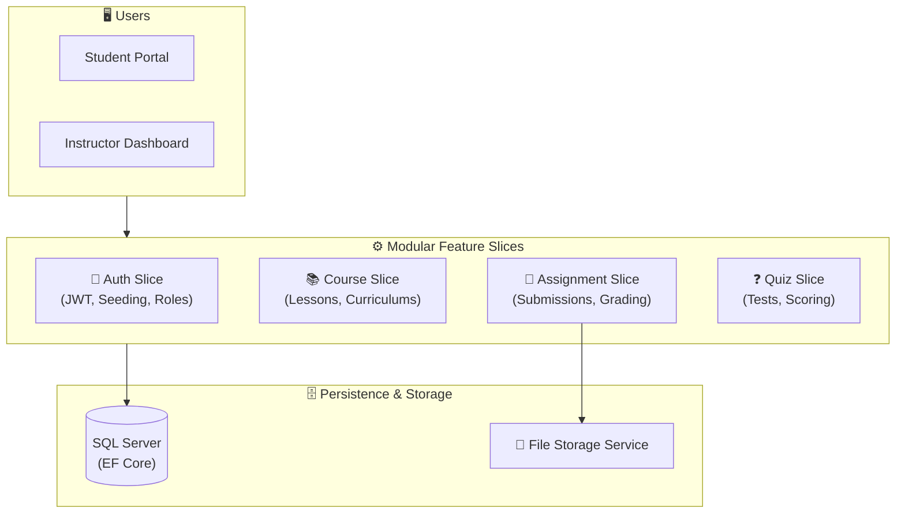

<div align="center">

# 🎓 ELearning_Project
### Modular E-Learning & Assessment Platform Built with CQRS & Vertical Feature Slices

[](https://dotnet.microsoft.com/)
[](https://learn.microsoft.com/en-us/dotnet/csharp/)
[](#-system-architecture)
[](LICENSE)
[](https://github.com/OmarAlfar0uk)

<p align="center">
  <a href="#-key-features">Key Features</a> •
  <a href="#-system-architecture">System Architecture</a> •
  <a href="#-tech-stack">Tech Stack</a> •
  <a href="#-getting-started">Getting Started</a> •
  <a href="#-author">Author</a>
</p>

</div>

---

## 📌 Executive Overview

**ELearning_Project** is an enterprise-scale online learning management system (LMS). Built to accommodate complex academic workflows, it features modular vertical slices for **Assignments**, **Quizzes**, **Course Management**, and **Authentication**. The solution incorporates pipeline behaviors for request validation, role seeding, and secure file storage.

> [!NOTE]
> Designed using **Vertical Slice Architecture**, **Pipeline Behaviors** (Validation & Logging), and **Seed Initializers** for role-based governance.

---

## ✨ Key Features

| ⚡ Feature | 💡 Description | 🛠 Engineering Detail |
|---|---|---|
| **📚 Course & Lesson Hierarchy** | Course authoring, syllabus structuring, and lesson progression | Relational domain models with foreign keys |
| **📝 Assignments & Grading** | Assignment submission, deadline tracking, and teacher grading | Abstracted file upload via `IFileService` |
| **❓ Quizzes & Self-Assessment** | Automated question evaluation and grading | Instant feedback calculation engine |
| **🔐 Role-Based Security** | Granular authorization for Students, Instructors, and Admins | Custom Identity models with automated role seeding |
| **🛡️ Pipeline Validation** | Strict request verification before hitting domain handlers | Pipeline behaviors ensuring valid payload contracts |

---

## 🏛 System Architecture



---

## ⚡ Tech Stack

- **Platform:** .NET 8 / C# 12
- **Architecture:** Vertical Slice Architecture & Pipeline Behaviors
- **Persistence:** Entity Framework Core with Code-First Migrations
- **Database:** Microsoft SQL Server
- **Security:** ASP.NET Core Identity with JWT Bearer Tokens

---

## 🚀 Getting Started

1. **Clone repository:**
   ```bash
   git clone https://github.com/OmarAlfar0uk/ELearning_Project.git
   cd ELearning_Project
   ```

2. **Run Migrations & Application:**
   ```bash
   dotnet ef database update --project ELearningProject
   dotnet run --project ELearningProject
   ```

---

## 👨‍💻 Author

**Omar Alfarouk**  
*Full-Stack .NET & Software Engineer*  

- 🌐 **GitHub:** [@OmarAlfar0uk](https://github.com/OmarAlfar0uk)
- 💼 **LinkedIn:** [omar-alfarouk](https://www.linkedin.com/in/omar-alfarouk-252471251/)
- 📧 **Email:** [omaralfarouk646@gmail.com](mailto:omaralfarouk646@gmail.com)

---

<div align="center">
  <sub>Built with ❤️ by Omar Alfarouk. Licensed under the <a href="LICENSE">MIT License</a>.</sub>
</div>
