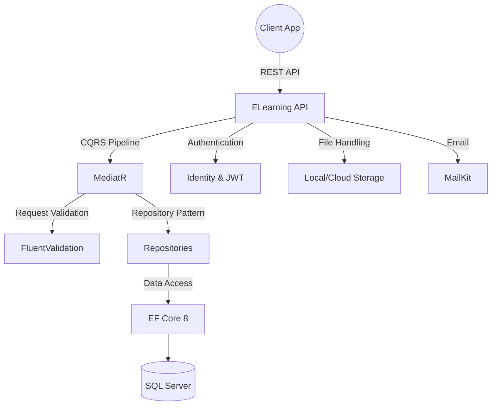

# 🎓 ELearning_Project

[](https://dotnet.microsoft.com/)
[](https://docs.microsoft.com/en-us/dotnet/csharp/)
[](https://docs.microsoft.com/en-us/ef/core/)
[](https://www.microsoft.com/en-us/sql-server)

**ELearning_Project** is a full-featured E-Learning platform API providing comprehensive course management, gamification, and student evaluation. It supports multi-track learning paths, secure file uploads, interactive assignments, and robust notification systems to deliver a modern educational experience.

## 🏗️ Architecture & Flow



## ✨ Features

| Feature | Description |
|---------|-------------|
| **Authentication & Auth** | JWT-based secure login, registration, and user profile management. |
| **Learning Tracks & Batches** | Organize students into specific educational tracks and time-based batches. |
| **Exams & Assignments** | Create, manage, and evaluate student exams and assignment submissions. |
| **Gamification (Coins)** | Reward students with digital coins based on performance and engagement. |
| **Student Evaluation** | Detailed evaluation metrics tracking student progress across materials and lectures. |
| **File Management** | Secure file upload and management for educational materials and submissions. |
| **Notifications** | Automated system for delivering important updates and alerts to users. |
| **Articles & Dashboard** | Publish educational articles and provide a comprehensive statistical dashboard. |

## 🛠️ Tech Stack

| Category | Technology |
|----------|------------|
| **Framework** | .NET 8.0, ASP.NET Core Web API |
| **Language** | C# 12 |
| **Architecture** | Repository Pattern, CQRS |
| **Data Access** | Entity Framework Core 8, SQL Server |
| **Identity & Security**| ASP.NET Core Identity, JWT Bearer Authentication |
| **Libraries** | MediatR 10, FluentValidation 12, MailKit |

## 📂 Project Structure

```text
ELearning_Project/
├── Controllers/         # API Endpoints for Exams, Batches, Submissions, etc.
├── Features/            # CQRS commands and queries
├── Repositories/        # Data access abstraction layer
├── Models/              # Domain entities
├── Extensions/          # Utility and setup extensions
└── Program.cs           # Application bootstrap and configuration
```

## 🚀 Getting Started

To get the project up and running locally, execute the following commands:

```bash
git clone https://github.com/OmarAlfar0uk/ELearning_Project.git
cd ELearning_Project
dotnet restore
dotnet run
```

---
**Author**  
GitHub: [OmarAlfar0uk](https://github.com/OmarAlfar0uk) | LinkedIn: [omar-alfarouk-252471251](https://www.linkedin.com/in/omar-alfarouk-252471251/) | Email: [omaralfarouk646@gmail.com](mailto:omaralfarouk646@gmail.com)
